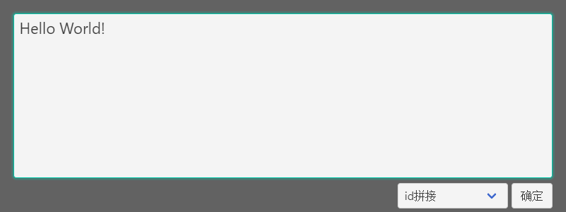
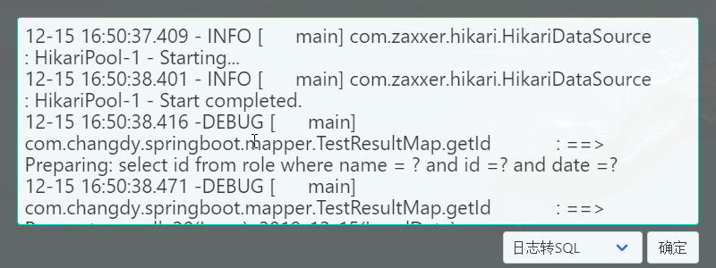
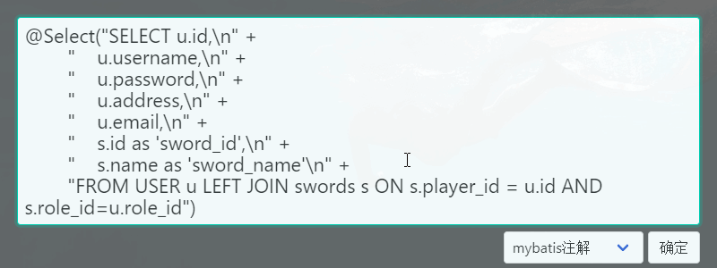
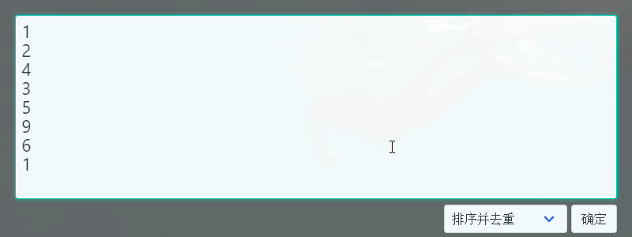
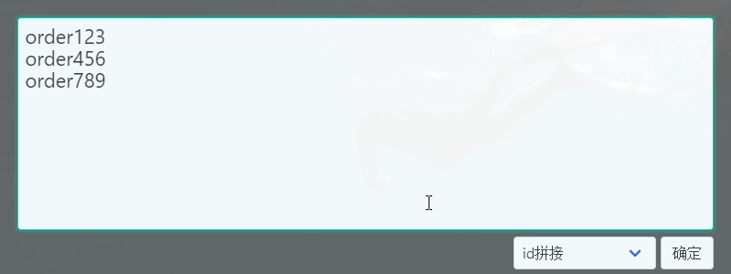

# string_utils



一款使用Electron开发的字符串处理小工具 ,使用快捷键 `Ctrl+Shift+1`唤醒 , 唤醒时会自动读取粘贴板,并预判断可能需要的处理方式, 当然也可以使用`k`,`j`或者鼠标进行切换 ,点击确定或`Enter`进行处理 ,处理之后的字符串会显示到文本框并同时复制到粘贴板. 按下`Esc`即最小化 , 状态栏小图标右键即可退出 , 主要有以下功能:

## Mybatis log 转 SQL



实现了类似 idea 插件 `MyBatis Log Plugin` 的功能, 可以提取Mybatis 日志中的SQL , 效果如下:

```log
12-15 16:50:37.409 - INFO [      main] com.zaxxer.hikari.HikariDataSource                           : HikariPool-1 - Starting...
12-15 16:50:38.401 - INFO [      main] com.zaxxer.hikari.HikariDataSource                           : HikariPool-1 - Start completed.
12-15 16:50:38.416 -DEBUG [      main] com.changdy.springboot.mapper.TestResultMap.getId            : ==>  Preparing: select id from role where name = ? and id =? and date =? 
12-15 16:50:38.471 -DEBUG [      main] com.changdy.springboot.mapper.TestResultMap.getId            : ==> Parameters: null, 20(Long), 2019-12-15(LocalDate)
12-15 16:50:38.503 -DEBUG [      main] com.changdy.springboot.mapper.TestResultMap.getId            : <==      Total: 0
null
12-15 16:50:38.513 -DEBUG [      main] com.changdy.springboot.mapper.TestResultMap.getId            : ==>  Preparing: select id from role where name = ? and id =? and date =? 
12-15 16:50:38.517 -DEBUG [      main] com.changdy.springboot.mapper.TestResultMap.getId            : ==> Parameters: HELO(String), 20(Long), 2019-12-15(LocalDate)
12-15 16:50:38.519 -DEBUG [      main] com.changdy.springboot.mapper.TestResultMap.getId            : <==      Total: 0
null
```

将会被转换成

```sql
select id from role where name = null and id =20 and date ='2019-12-15' ;
select id from role where name = 'HELO' and id =20 and date ='2019-12-15' ;
```

## Mybatis 注解转SQL



我个人是比较喜欢使用Mybatis 注解 , 但是注解有时候不便于使用 (当然现在使用了kotlin 就没这个问题了)

```
@Select("SELECT u.id,\n" +
        "    u.username,\n" +
        "    u.password,\n" +
        "    u.address,\n" +
        "    u.email,\n" +
        "    s.id as 'sword_id',\n" +
        "    s.name as 'sword_name'\n" +
        "FROM USER u LEFT JOIN swords s ON s.player_id = u.id AND s.role_id=u.role_id")
```

可以转换成

```sql
SELECT u.id,
    u.username,
    u.password,
    u.address,
    u.email,
    s.id as 'sword_id',
    s.name as 'sword_name'
FROM USER u LEFT JOIN swords s ON s.player_id = u.id AND s.role_id=u.role_id
```

## 字符串去重和排序



支持字符串进行 排序与 去重 

进行排序时 , 如果检测到所有字符串都可转换成数字类型,则使用数字大小进行排序 , 针对可能丢失精度的问题使用了 [bignumber.js](https://github.com/MikeMcl/bignumber.js)  . 如果字符串中包含非数字,则根据字典进行排序

去重相比较简单 , 但是mac/linux和windows 使用的换行符有差异 , 是个小坑需要注意

## ID拼接



可以把多行字符串以指定的规则进行拼接

```
1
2
3
4
5
6
7
8
```

在以下格式中进行切换

```
1,2,3,4,5,6,7,8               // 数字模式拼接
^1$|^2$|^3$|^4$|^5$|^6$|^7$|^8$ // 正则模式拼接
"1","2","3","4","5","6","7","8" //字符串模式拼接
```
